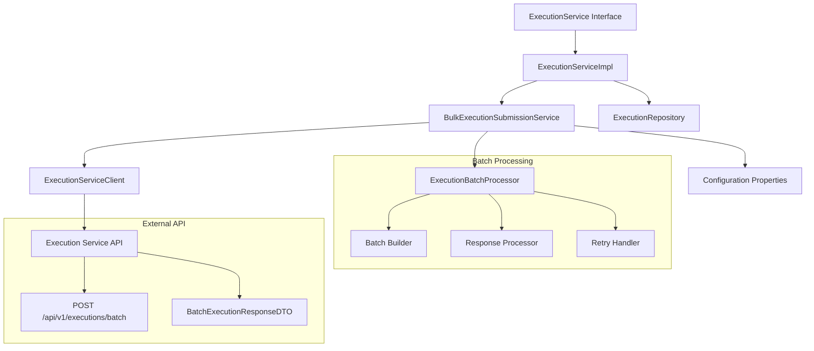
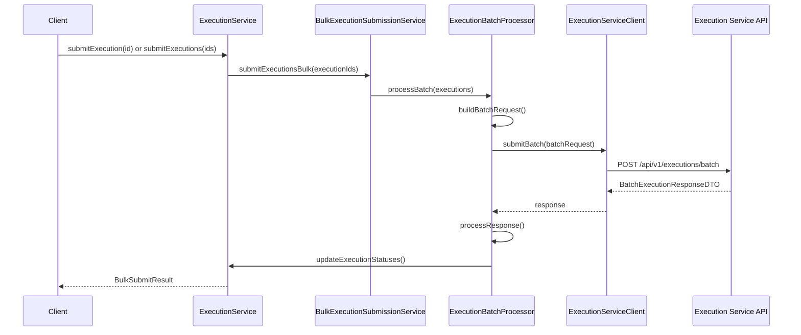

# Design Document

## Overview

This design implements bulk execution submissions to replace the current one-by-one execution posting mechanism in the Globeco Trade Service. The solution introduces a new bulk submission service that batches executions and uses the Execution Service's POST /api/v1/executions/batch API endpoint. The design maintains backward compatibility while providing significant performance improvements under high load conditions.

## Architecture

### High-Level Architecture



### Component Interaction Flow



## Components and Interfaces

### 1. Enhanced ExecutionService Interface

```java
public interface ExecutionService {
    // Existing methods remain unchanged for backward compatibility
    SubmitResult submitExecution(Integer id);
    
    // New bulk submission methods
    BulkSubmitResult submitExecutions(List<Integer> executionIds);
    BulkSubmitResult submitExecutionsBatch(List<Integer> executionIds, int batchSize);
    
    // Result classes
    class BulkSubmitResult {
        private int totalRequested;
        private int successful;
        private int failed;
        private List<ExecutionSubmitResult> results;
        private String overallStatus;
        private String message;
        // getters and setters
    }
    
    class ExecutionSubmitResult {
        private Integer executionId;
        private String status; // "SUCCESS", "FAILED", "RETRY_EXHAUSTED"
        private String message;
        private Integer executionServiceId;
        // getters and setters
    }
}
```

### 2. BulkExecutionSubmissionService

```java
@Service
public class BulkExecutionSubmissionService {
    
    @Value("${execution.service.batch.size:100}")
    private int defaultBatchSize;
    
    @Value("${execution.service.batch.max-size:100}")
    private int maxBatchSize;
    
    public BulkSubmitResult submitExecutionsBulk(List<Execution> executions) {
        // Validate batch size
        // Split into batches if needed
        // Process each batch
        // Aggregate results
    }
    
    private BulkSubmitResult processBatch(List<Execution> batch) {
        // Build batch request
        // Submit to execution service
        // Process response
        // Update execution statuses
    }
}
```

### 3. ExecutionBatchProcessor

```java
@Component
public class ExecutionBatchProcessor {
    
    public BatchExecutionRequestDTO buildBatchRequest(List<Execution> executions) {
        // Convert executions to ExecutionPostDTO format
        // Build BatchExecutionRequestDTO
    }
    
    public BulkSubmitResult processResponse(
        BatchExecutionResponseDTO response, 
        List<Execution> originalExecutions) {
        // Map response results back to executions
        // Update execution statuses based on results
        // Handle partial successes and failures
    }
    
    public List<Execution> extractFailedExecutions(
        BulkSubmitResult result, 
        List<Execution> originalExecutions) {
        // Extract executions that failed for retry
    }
}
```

### 4. Enhanced ExecutionServiceClient

```java
@Component
public class ExecutionServiceClient {
    
    @Qualifier("executionServiceRetryTemplate")
    private RetryTemplate retryTemplate;
    
    @Value("${execution.service.base-url}")
    private String executionServiceBaseUrl;
    
    public BatchExecutionResponseDTO submitBatch(BatchExecutionRequestDTO request) {
        // Use retry template for resilient API calls
        // Handle different HTTP response codes (201, 207, 400, 5xx)
        // Log performance metrics
    }
    
    private BatchExecutionResponseDTO executeWithRetry(BatchExecutionRequestDTO request) {
        // Implement retry logic with exponential backoff
        // Handle transient failures
    }
}
```

### 5. Configuration Properties

```java
@ConfigurationProperties(prefix = "execution.service.batch")
@Component
public class ExecutionBatchProperties {
    private int size = 100;
    private int maxSize = 100;
    private boolean enableBatching = true;
    private int retryFailedIndividually = 3;
    
    // getters and setters with validation
}
```

## Data Models

### 1. Request/Response DTOs

The implementation will reuse existing DTOs from the Execution Service OpenAPI specification:

- `BatchExecutionRequestDTO` - Contains array of `ExecutionPostDTO`
- `BatchExecutionResponseDTO` - Contains status, counts, and array of `ExecutionResultDTO`
- `ExecutionResultDTO` - Contains individual execution result with status and execution data

### 2. Internal Data Structures

```java
public class ExecutionBatchContext {
    private List<Execution> originalExecutions;
    private BatchExecutionRequestDTO request;
    private Map<Integer, Integer> requestIndexToExecutionId;
    private long startTime;
    private int attemptNumber;
}

public class BatchMetrics {
    private long processingTimeMs;
    private int batchSize;
    private int successCount;
    private int failureCount;
    private String batchId;
}
```

## Error Handling

### 1. HTTP Response Code Handling

- **HTTP 201**: All executions successful - update all to SENT status
- **HTTP 207**: Partial success - process individual results from response
- **HTTP 400**: All executions failed - mark all as failed with error details
- **HTTP 5xx**: Server error - retry entire batch with exponential backoff

### 2. Individual Execution Failures

```java
public class ExecutionFailureHandler {
    
    public void handlePartialFailures(
        BatchExecutionResponseDTO response, 
        List<Execution> executions) {
        
        for (ExecutionResultDTO result : response.getResults()) {
            if ("FAILED".equals(result.getStatus())) {
                // Mark specific execution as failed
                // Log detailed error information
                // Determine if retry is appropriate
            }
        }
    }
    
    public List<Execution> prepareForRetry(List<Execution> failedExecutions) {
        // Filter executions suitable for retry
        // Apply retry limits and backoff
    }
}
```

### 3. Retry Strategy

- **Network/Timeout Errors**: Retry entire batch up to configured limit
- **Individual Failures**: Extract failed executions and retry in smaller batches
- **Permanent Failures**: Mark as failed after retry exhaustion
- **Exponential Backoff**: Use existing retry template configuration

## Testing Strategy

### 1. Unit Tests

- `BulkExecutionSubmissionServiceTest`: Test batch processing logic
- `ExecutionBatchProcessorTest`: Test request building and response processing
- `ExecutionServiceClientTest`: Test API integration with mocked responses
- `ExecutionFailureHandlerTest`: Test error handling scenarios

### 2. Integration Tests

- `BulkExecutionSubmissionIntegrationTest`: End-to-end batch submission testing
- `ExecutionServiceRetryIntegrationTest`: Test retry mechanisms with simulated failures
- `ExecutionBatchPerformanceTest`: Performance comparison with single submissions

### 3. Test Scenarios

```java
@Test
public void testSuccessfulBatchSubmission() {
    // Test all executions succeed (HTTP 201)
}

@Test
public void testPartialBatchFailure() {
    // Test mixed success/failure (HTTP 207)
}

@Test
public void testBatchSizeLimit() {
    // Test batching with size limits
}

@Test
public void testRetryOnServerError() {
    // Test retry behavior on 5xx errors
}

@Test
public void testBackwardCompatibility() {
    // Test single execution submission still works
}
```

### 4. Performance Testing

- Measure throughput improvement vs single submissions
- Test under various batch sizes (1, 10, 50, 100)
- Monitor memory usage and garbage collection impact
- Validate retry behavior under load

## Configuration Management

### 1. Application Properties

```properties
# Bulk Execution Submission Configuration
execution.service.batch.size=100
execution.service.batch.max-size=100
execution.service.batch.enable-batching=true
execution.service.batch.retry-failed-individually=3
execution.service.batch.metrics-enabled=true

# Enhanced Retry Configuration for Bulk Operations
execution.service.bulk.retry.max-attempts=3
execution.service.bulk.retry.initial-delay=2000
execution.service.bulk.retry.multiplier=2
execution.service.bulk.retry.max-delay=30000
```

### 2. Environment-Specific Tuning

- **Development**: Smaller batch sizes for easier debugging
- **Testing**: Configurable failure injection for testing
- **Production**: Optimized batch sizes based on load patterns

## Performance Considerations

### 1. Batch Size Optimization

- Default batch size: 100 (API maximum)
- Configurable based on system capacity
- Automatic splitting for larger request sets
- Memory usage monitoring for large batches

### 2. Database Transaction Management

- Use existing transaction patterns from ExecutionServiceImpl
- Minimize transaction scope for bulk updates
- Batch database updates where possible
- Maintain data consistency during partial failures

### 3. Monitoring and Metrics

```java
@Component
public class BulkExecutionMetrics {
    
    @EventListener
    public void recordBatchSubmission(BatchSubmissionEvent event) {
        // Record batch size, processing time, success rate
        // Track performance improvements over single submissions
    }
    
    public void recordRetryAttempt(String reason, int batchSize) {
        // Monitor retry patterns and failure reasons
    }
}
```

### 4. Memory Management

- Stream processing for large execution lists
- Lazy loading of execution data
- Proper cleanup of batch contexts
- Monitoring for memory leaks in batch processing

## Migration Strategy

### 1. Backward Compatibility

- Existing `submitExecution(Integer id)` method unchanged
- Internal implementation routes through bulk processor with batch size 1
- All existing callers continue to work without modification

### 2. Gradual Adoption

- Phase 1: Implement bulk infrastructure with single-execution routing
- Phase 2: Identify high-volume callers and migrate to bulk methods
- Phase 3: Optimize batch sizes based on production metrics
- Phase 4: Deprecate single-execution paths (optional future enhancement)

### 3. Feature Flags

```properties
execution.service.batch.enable-for-single=true
execution.service.batch.enable-auto-batching=false
execution.service.batch.auto-batch-window-ms=1000
```

This design provides a robust, performant, and backward-compatible solution for bulk execution submissions while maintaining the existing service patterns and error handling approaches.