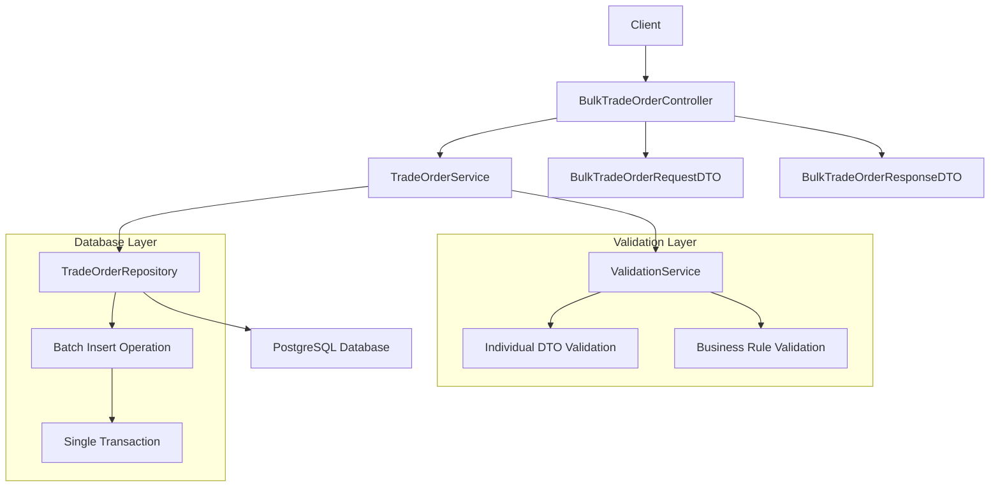

# Design Document

## Overview

The bulk trade orders feature introduces a new REST API endpoint `POST /api/v1/tradeOrders/bulk` that allows clients to submit multiple trade orders in a single atomic transaction. This design focuses on performance optimization through batch database operations while maintaining consistency with existing API patterns.

The implementation will reuse existing DTOs and validation logic from the single trade order endpoint, ensuring consistency and reducing code duplication. The bulk operation will be atomic - either all trade orders succeed or all fail together.

## Architecture

### API Design

**Endpoint:** `POST /api/v1/tradeOrders/bulk`

**Request Body:**
```json
{
  "tradeOrders": [
    {
      "orderId": 12345,
      "portfolioId": "PORTFOLIO_001",
      "orderType": "BUY",
      "securityId": "AAPL",
      "quantity": 100.00,
      "limitPrice": 150.25,
      "tradeTimestamp": "2024-01-15T10:30:00Z",
      "blotterId": 1
    }
  ]
}
```

**Response Body (Success):**
```json
{
  "status": "SUCCESS",
  "message": "All trade orders created successfully",
  "totalRequested": 2,
  "successful": 2,
  "failed": 0,
  "results": [
    {
      "requestIndex": 0,
      "status": "SUCCESS",
      "tradeOrder": {
        "id": 101,
        "orderId": 12345,
        // ... full TradeOrderResponseDTO
      }
    }
  ]
}
```

### Component Architecture



## Components and Interfaces

### 1. Controller Layer

**BulkTradeOrderController** (New endpoint in existing TradeOrderController)
- Handles HTTP request/response for bulk operations
- Validates request structure and size limits
- Delegates to service layer for business logic
- Maps service responses to HTTP responses with appropriate status codes

### 2. DTO Layer

**BulkTradeOrderRequestDTO** (New)
```java
public class BulkTradeOrderRequestDTO {
    @NotNull
    @Size(min = 1, max = 1000, message = "Bulk size must be between 1 and 1000")
    private List<@Valid TradeOrderPostDTO> tradeOrders;
}
```

**BulkTradeOrderResponseDTO** (New)
```java
public class BulkTradeOrderResponseDTO {
    public enum BulkStatus { SUCCESS, FAILURE }
    
    private BulkStatus status;
    private String message;
    private Integer totalRequested;
    private Integer successful;
    private Integer failed;
    private List<TradeOrderResultDTO> results;
}

public class TradeOrderResultDTO {
    public enum ResultStatus { SUCCESS, FAILURE }
    
    private Integer requestIndex;
    private ResultStatus status;
    private String message;
    private TradeOrderResponseDTO tradeOrder; // null if failed
}
```

### 3. Service Layer

**TradeOrderService** (Enhanced)
- Add new method: `List<TradeOrder> createTradeOrdersBulk(List<TradeOrder> tradeOrders)`
- Implement atomic transaction handling
- Perform batch validation before database operations
- Return results with success/failure status for each order

### 4. Repository Layer

**TradeOrderRepository** (Enhanced)
- Add method: `List<TradeOrder> saveAllInBatch(List<TradeOrder> tradeOrders)`
- Implement optimized batch insert using JPA batch operations
- Ensure single transaction boundary
- Handle batch-specific database constraints and errors

## Data Models

### Database Operations

The bulk insert will use JPA's batch processing capabilities:

```java
@Transactional
public List<TradeOrder> createTradeOrdersBulk(List<TradeOrder> tradeOrders) {
    // Validate all orders first
    validateTradeOrdersBulk(tradeOrders);
    
    // Perform batch insert in single transaction
    return tradeOrderRepository.saveAllInBatch(tradeOrders);
}
```

### Batch Configuration

Configure JPA for optimal batch performance:
```properties
spring.jpa.properties.hibernate.jdbc.batch_size=50
spring.jpa.properties.hibernate.order_inserts=true
spring.jpa.properties.hibernate.batch_versioned_data=true
```

## Error Handling

### Validation Errors

1. **Request Level Validation**
   - Empty or null trade orders array
   - Array size exceeding maximum limit (1000)
   - Invalid JSON structure

2. **Individual Order Validation**
   - Reuse existing TradeOrderPostDTO validation
   - Business rule validation (portfolio exists, security exists, etc.)
   - Data type and format validation

### Database Errors

1. **Constraint Violations**
   - Duplicate order IDs within batch
   - Foreign key constraint failures
   - Data integrity violations

2. **Transaction Failures**
   - Database connection issues
   - Timeout errors
   - Deadlock detection

### Error Response Format

```json
{
  "status": "FAILURE",
  "message": "Bulk operation failed due to validation errors",
  "totalRequested": 3,
  "successful": 0,
  "failed": 3,
  "results": [
    {
      "requestIndex": 0,
      "status": "FAILURE",
      "message": "Invalid portfolio ID: INVALID_PORTFOLIO",
      "tradeOrder": null
    }
  ]
}
```

## Testing Strategy

### Unit Tests

1. **Controller Tests**
   - Valid bulk request handling
   - Invalid request validation
   - Error response formatting
   - HTTP status code mapping

2. **Service Tests**
   - Bulk validation logic
   - Transaction rollback scenarios
   - Performance with large batches
   - Individual order failure handling

3. **Repository Tests**
   - Batch insert operations
   - Transaction boundary testing
   - Database constraint handling
   - Performance benchmarking

### Integration Tests

1. **End-to-End API Tests**
   - Complete bulk submission workflow
   - Database state verification
   - Error scenario testing
   - Performance under load

2. **Database Integration Tests**
   - Batch insert performance
   - Transaction isolation
   - Concurrent access handling
   - Data consistency verification

### Performance Tests

1. **Load Testing**
   - Large batch sizes (up to 1000 orders)
   - Concurrent bulk submissions
   - Memory usage monitoring
   - Response time measurement

2. **Stress Testing**
   - Maximum throughput testing
   - Resource exhaustion scenarios
   - Database connection pooling
   - Error recovery testing

## Performance Optimizations

### Database Level

1. **Batch Processing**
   - Configure Hibernate batch size for optimal performance
   - Use batch insert statements instead of individual inserts
   - Enable batch ordering for better SQL generation

2. **Connection Management**
   - Optimize connection pool settings
   - Use appropriate transaction isolation levels
   - Minimize transaction duration

### Application Level

1. **Memory Management**
   - Stream processing for large batches
   - Minimize object creation during validation
   - Efficient DTO mapping strategies

2. **Validation Optimization**
   - Fail-fast validation approach
   - Batch validation where possible
   - Cache frequently accessed reference data

### Monitoring and Metrics

1. **Performance Metrics**
   - Batch processing time
   - Individual order processing time
   - Database operation duration
   - Memory usage patterns

2. **Business Metrics**
   - Bulk submission success rates
   - Average batch sizes
   - Error distribution analysis
   - Throughput measurements