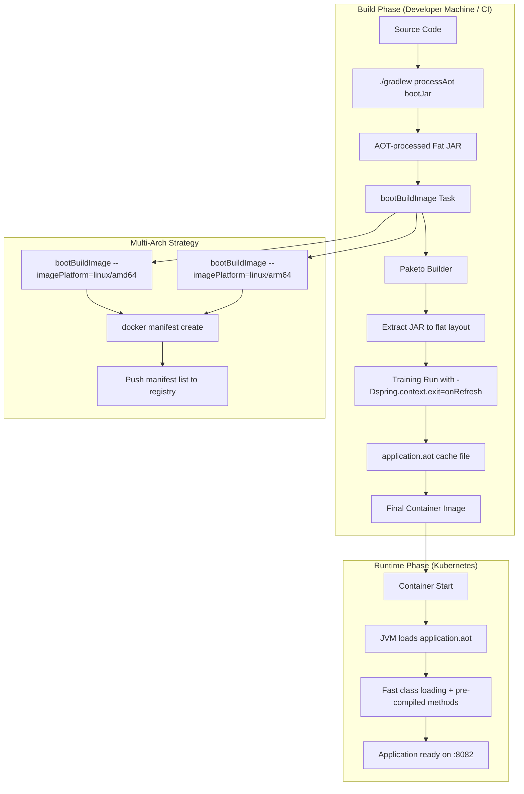

# Design Document: Shorten Startup Time

## Overview

This design transforms the GlobeCo Trade Service build pipeline to produce container images that start significantly faster by leveraging Java 25's AOT Cache (Project Leyden JEP-514) and Spring AOT processing via Paketo buildpacks. The approach replaces the multi-stage Dockerfile with Spring Boot's `bootBuildImage` Gradle task, which orchestrates a training run during image build to produce a pre-warmed JVM cache (CDS archive + JIT profiles) baked directly into the container image.

The key performance improvement comes from the AOT Cache training run: during image build, the application starts briefly (up to context refresh), and the JVM records all loaded classes and compilation decisions into an `application.aot` file. On subsequent production starts, the JVM loads this cache directly, skipping class parsing and JIT compilation for pre-cached methods.

**Expected improvement**: Based on the Paketo team's benchmarks with Spring Boot applications of similar complexity, startup time reductions of 50-75% are typical (from ~2.5s to ~0.6-1.2s for medium-complexity apps).

## Architecture



### Key Architectural Decisions

1. **AOT Cache without Spring AOT processing at build time**: We use `BP_JVM_AOTCACHE_ENABLED=true` but do NOT combine it with `BP_SPRING_AOT_ENABLED=true` in the buildpack configuration. The Paketo buildpack has a hard gate preventing `TRAINING_RUN_JAVA_TOOL_OPTIONS` when both AOT flags are enabled, because Spring AOT pre-bakes bean definitions and runtime `-D` overrides have no effect. Instead, Spring AOT (`processAot`) runs during the Gradle build phase (producing optimized source), and the buildpack independently handles the AOT Cache training run.

2. **Training run database strategy**: The training run starts the application inside the build container where no PostgreSQL is available. We configure `TRAINING_RUN_JAVA_TOOL_OPTIONS` to disable Flyway and prevent Hibernate from accessing JDBC metadata, following the official Spring Lifecycle Smoke Tests patterns.

3. **Multi-architecture via sequential builds + manifest**: Since `bootBuildImage` does not support multi-arch in a single invocation, `kbuild.sh` invokes `bootBuildImage` twice (once per platform using the `imagePlatform` property introduced in Spring Boot 3.4), then assembles a Docker manifest list and pushes it.

## Components and Interfaces

### 1. build.gradle Modifications

**Responsibilities**: Define Java 25 toolchain, configure `bootBuildImage` task with Paketo builder and AOT cache environment, enable Spring AOT processing.

```groovy
java {
    toolchain {
        languageVersion = JavaLanguageVersion.of(25)
    }
}

tasks.named('bootBuildImage') {
    builder = 'paketobuildpacks/builder-noble-java-tiny:latest'
    imageName = "kasbench/globeco-trade-service:${project.version}"
    tags = ["kasbench/globeco-trade-service:latest"]
    environment = [
        'BP_JVM_VERSION'                  : '25',
        'BP_JVM_AOTCACHE_ENABLED'         : 'true',
        'BP_SPRING_AOT_ENABLED'           : 'true',
        'TRAINING_RUN_JAVA_TOOL_OPTIONS'  : '-Dspring.flyway.enabled=false -Dspring.jpa.properties.hibernate.boot.allow_jdbc_metadata_access=false'
    ]
}
```

**Interface**: Gradle CLI (`./gradlew bootBuildImage`, `./gradlew bootBuildImage --imagePlatform=linux/amd64`)

### 2. kbuild.sh (Revised Build Script)

**Responsibilities**: Orchestrate multi-arch image production, manifest assembly, registry push, and Kubernetes redeployment.

```bash
#!/bin/bash
set -e

VERSION="1.0.3"
IMAGE="kasbench/globeco-trade-service"

# Build for amd64
./gradlew bootBuildImage --imagePlatform=linux/amd64 \
  -PimageName="${IMAGE}:${VERSION}-amd64"

# Build for arm64
./gradlew bootBuildImage --imagePlatform=linux/arm64 \
  -PimageName="${IMAGE}:${VERSION}-arm64"

# Push architecture-specific images
docker push "${IMAGE}:${VERSION}-amd64"
docker push "${IMAGE}:${VERSION}-arm64"

# Create and push manifest lists
docker manifest create "${IMAGE}:${VERSION}" \
  "${IMAGE}:${VERSION}-amd64" \
  "${IMAGE}:${VERSION}-arm64"
docker manifest create "${IMAGE}:latest" \
  "${IMAGE}:${VERSION}-amd64" \
  "${IMAGE}:${VERSION}-arm64"

docker manifest push "${IMAGE}:${VERSION}"
docker manifest push "${IMAGE}:latest"

# Redeploy to Kubernetes
kubectl delete -f k8s/deployment.yaml
kubectl apply -f k8s/deployment.yaml
```

**Interface**: Shell execution (`./kbuild.sh`)

### 3. application-training.properties (New Spring Profile)

**Responsibilities**: Provide configuration overrides specifically for the AOT cache training run, disabling subsystems that require external connectivity.

```properties
# Disable Flyway migration during training run
spring.flyway.enabled=false

# Prevent Hibernate from contacting the database for metadata
spring.jpa.properties.hibernate.boot.allow_jdbc_metadata_access=false

# Explicitly set dialect to avoid JDBC metadata lookup
spring.jpa.database-platform=org.hibernate.dialect.PostgreSQLDialect
```

**Note**: This profile is activated by `TRAINING_RUN_JAVA_TOOL_OPTIONS` passing `-Dspring.profiles.active=training` or by individual property overrides. The buildpack's `TRAINING_RUN_JAVA_TOOL_OPTIONS` mechanism applies these only during the training run, not at production runtime.

### 4. CI Workflow (.github/workflows/docker-publish.yml)

**Responsibilities**: Updated to use Java 25, invoke `bootBuildImage` for multi-arch builds, and push manifest lists.

**Key changes**:
- `setup-java` action: `java-version: '25'`
- Replace `docker/build-push-action` with `./gradlew bootBuildImage` invocations per architecture
- Add manifest creation and push steps

### 5. Dockerfile (Retained, Not Primary)

**Responsibilities**: Retained in the repository as a fallback build mechanism. Updated base images to Java 25 for consistency, but not used in the primary build path.

```dockerfile
# ---- Build Stage ----
FROM eclipse-temurin:25-jdk AS build
WORKDIR /workspace/app
COPY . .
RUN ./gradlew clean bootJar --no-daemon

# ---- Run Stage ----
FROM eclipse-temurin:25-jre
WORKDIR /app
COPY --from=build /workspace/app/build/libs/*.jar app.jar
EXPOSE 8082
ENTRYPOINT ["java", "-jar", "app.jar"]
```

## Data Models

No data model changes. The existing JPA entities, Flyway migrations, and database schema remain unchanged. The AOT cache operates at the JVM/classloading level and does not affect application data structures.

### Build Artifacts Produced

| Artifact | Description | Location in Image |
|----------|-------------|-------------------|
| `runner.jar` | Extracted thin application JAR | `/workspace/runner.jar` |
| `lib/` | Extracted dependency JARs | `/workspace/lib/` |
| `application.aot` | AOT cache file (CDS + JIT profiles) | `/workspace/application.aot` |

### Configuration Properties (Training Run)

| Property | Value | Purpose |
|----------|-------|---------|
| `spring.flyway.enabled` | `false` | Prevents Flyway from connecting to PostgreSQL |
| `spring.jpa.properties.hibernate.boot.allow_jdbc_metadata_access` | `false` | Prevents Hibernate from querying JDBC metadata |
| `spring.jpa.database-platform` | `org.hibernate.dialect.PostgreSQLDialect` | Provides dialect without JDBC introspection |
| `spring.context.exit` | `onRefresh` | Exits JVM after context refresh (set by buildpack) |

## Correctness Properties

Property-based testing is **not applicable** for this feature. All acceptance criteria fall into SMOKE (one-time build/configuration verification) or INTEGRATION (container startup, K8s deployment, external service connectivity) categories. The changes are infrastructure and build configuration — Gradle buildpack settings, shell scripts, Dockerfiles, and CI workflows — rather than application logic with a meaningful input space where 100+ randomized iterations would reveal bugs.

**Why PBT does not apply:**
- No pure functions are being added or modified
- Behavior does not vary meaningfully with input (a build either succeeds or fails)
- All verification is "did the infrastructure configuration produce the expected artifact" — binary pass/fail
- Testing involves expensive external operations (Docker builds, container starts, K8s deployments)

The Testing Strategy section below describes the appropriate integration and smoke tests.

## Error Handling

### Build-Time Errors

| Error Scenario | Detection | Handling |
|----------------|-----------|----------|
| Training run fails (database connection) | Non-zero exit from training run phase | Buildpack outputs error with stage name; `TRAINING_RUN_JAVA_TOOL_OPTIONS` must be verified |
| Java 25 toolchain unavailable | Gradle toolchain resolution failure | Gradle auto-downloads JDK 25 via toolchain auto-provisioning; CI uses `setup-java@v4` |
| AOT processing finds incompatible library | `processAot` task fails | Build fails with error identifying problematic bean/class; developer must add AOT hints |
| Architecture-specific build fails | Non-zero exit from `bootBuildImage` | `kbuild.sh` exits immediately (`set -e`); no partial manifest pushed |
| Docker daemon unavailable | `bootBuildImage` cannot connect to Docker | Task fails with connection error; Docker Desktop or daemon must be running |

### Runtime Errors

| Error Scenario | Detection | Handling |
|----------------|-----------|----------|
| AOT cache file invalid/corrupted | JVM silently ignores cache on mismatch | Application starts normally (cold start); no crash, just slower startup |
| AOT cache built with different JVM version | JVM detects version mismatch | Cache discarded silently; falls back to standard startup |
| OTel collector unreachable | Micrometer export failure | Existing resilience: metrics/traces buffered, retried via existing configuration |
| Flyway migration fails at runtime | Application context fails to start | Pod crashes with non-zero exit; startup probe will detect via health endpoint failure |

### Rollback Strategy

If the new image causes issues in Kubernetes:
1. The previous Dockerfile-based build remains functional — rebuild using `docker buildx build` as before
2. The Kubernetes deployment uses `imagePullPolicy: IfNotPresent` — roll back by changing the image tag in the manifest and reapplying
3. AOT cache mismatch is graceful — the JVM always falls back to a standard (slower) startup rather than crashing

## Testing Strategy

### Smoke Tests (Build Verification)

These validate one-time build configuration correctness:

| Test | Validates Requirement | Method |
|------|----------------------|--------|
| `./gradlew processAot` exits 0 | 2.1, 2.2 | Run task, check exit code |
| `./gradlew bootBuildImage` exits 0 | 4.1, 4.3 | Run task, check exit code and image exists locally |
| `./gradlew test` passes with Java 25 | 1.6, 7.7 | Run test suite, check zero failures |
| CI workflow uses Java 25 | 1.5 | Inspect workflow YAML |

### Integration Tests (Container + K8s Verification)

These validate the produced container in a real environment:

| Test | Validates Requirement | Method |
|------|----------------------|--------|
| Container responds on `/actuator/health/readiness` | 6.1, 6.3 | `docker run` + `curl` health endpoint |
| Container responds on `/actuator/health/liveness` | 6.2 | `curl` liveness endpoint |
| Container logs show AOT cache loading | 3.6 | Grep container logs for AOT cache indicators |
| AOT cache file exists in image | 3.5 | `docker run --entrypoint ls` to inspect filesystem |
| Multi-arch manifest contains both platforms | 5.1, 5.2, 5.3 | `docker manifest inspect` shows linux/amd64 + linux/arm64 |
| Container operates within 700Mi memory | 6.4 | `docker stats` during operation |
| REST API returns correct CRUD results | 7.1 | HTTP requests to trade order/blotter endpoints |
| Flyway migrations complete | 7.2 | Check application logs for Flyway success |
| Caffeine caches active | 7.3 | GET `/actuator/caches` |
| Circuit breakers report CLOSED | 7.4 | GET `/actuator/health` |
| OpenAPI endpoint serves valid spec | 7.5 | GET `/v3/api-docs` returns 200 with valid JSON |
| Startup time < baseline | 3.3 (goal) | Parse "Started ... in X seconds" from logs |

### Unit Testing

The existing JUnit 5 test suite runs unchanged with Java 25 — this validates that Spring AOT processing does not break application logic. The test suite already uses H2 (present as a test dependency) and validates all service/repository behavior.

### Compatibility Verification Matrix

| Integration | AOT Concern | Risk Level | Verification |
|-------------|-------------|-----------|-------------|
| Spring Data JPA | Hibernate proxy generation | Medium | Existing CRUD tests pass; runtime API calls succeed |
| Flyway | Must be disabled during training, active at runtime | High | Training run exits 0; runtime migrations complete |
| Caffeine Cache | Static configuration, AOT-safe | Low | Cache actuator endpoint reports active caches |
| Resilience4j | Annotation-based proxies need AOT hints | Medium | Circuit breaker health endpoint reports CLOSED |
| SpringDoc OpenAPI | Classpath scanning for API docs | Medium | OpenAPI endpoint returns valid 3.x document |
| Micrometer + OTel | Registry initialization, bridge setup | Low | Actuator metrics endpoint returns data |
| Spring Retry | Annotation-based AOP proxies | Medium | Retry configuration visible in actuator |
