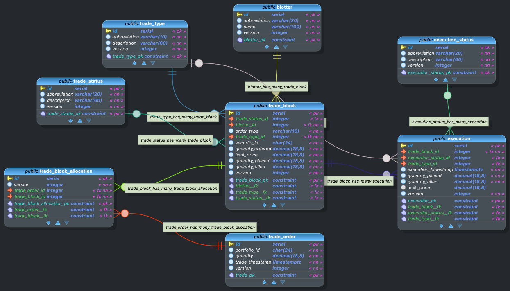

# GlobeCo Trade Service Requirements

## Background

This document provides requirements for the Trade Service.  This service is designed to manage trades as part of a portfolio management application.

This microservice will be deployed on Kubernetes 1.33.

This microservice is part of the GlobeCo suite of applications for benchmarking Kubernetes autoscaling.

Name of service: Trade Service  
Host: globeco-trade-service  
Port: 8082  

Author: Noah Kriehger  
Email: noah@kasbench.org

## Technology

| Technology | Version | Notes |
|---------------------------|----------------|---------------------------------------|
| Java | 21 | |
| Spring Boot | 3.4.5 | |
| Spring Dependency Mgmt | 1.1.7 | Plugin for dependency management |
| Spring Boot Starter Web | (from BOM) | For REST API |
| Spring Boot Starter Data JPA | (from BOM) | For JPA/Hibernate ORM |
| Spring Boot Starter Actuator | (from BOM) | For monitoring/management |
| Flyway Core | (from BOM) | Database migrations |
| Flyway Database PostgreSQL| (from BOM) | PostgreSQL-specific Flyway support |
| PostgreSQL JDBC Driver | (from BOM) | Runtime JDBC driver |
| JUnit Platform Launcher | (from BOM) | For running tests |
| Spring Boot Starter Test | (from BOM) | For testing |
| PostgreSQL (Database) | 17 | As specified in [globeco-trade-service-postgresql](https://github.com/kasbench/globeco-trade-service-postgresql) |
| Caffeine | 3.1.8 | In-memory caching provider for Spring's caching abstraction (5 minute TTL) |

Notes:
- (from BOM) means the version is managed by the Spring Boot BOM (Bill of Materials) and will match the Spring Boot version unless overridden.
- All dependencies are managed via Maven Central.
- The project uses Gradle as the build tool.
- Spring's caching abstraction is used with Caffeine for in-memory caching with a 5 minute time-to-live (TTL) for relevant caches.

## Other services

| Name | Host | Port | Description |
| --- | --- | --- | --- |
Security Service | globeco-security-service | 8000 | Manages securities such as stocks, bonds, and options |
| Order Service | globeco-order-service | 8001 |

## Caching
- Use Spring's caching abstraction for security, blotter, trade_type, trade_status, execution_status
- Caches should have a 5 minute EOL
- Initially, all caches should be with in-memory caching

## Database Information

The database is at globeco-trade-service-postgresql:32800
The database is the default `postgres` database.
The schema is the default `public` schema.
The owner of all database objects is `postgres`.

## Entity Relationship Diagram

## Data dictionary 

### _public_.**blotter** `Table`
| Name | Data type  | PK | FK | UQ  | Not null | Default value | Description |
| --- | --- | :---: | :---: | :---: | :---: | --- | --- |
| id | serial | &#10003; |  |  | &#10003; |  |  |
| abbreviation | varchar(20) |  |  |  | &#10003; |  |  |
| name | varchar(100) |  |  |  | &#10003; |  |  |
| version | integer |  |  |  | &#10003; | 1 |  |

#### Constraints
| Name | Type | Column(s) | References | On Update | On Delete | Expression | Description |
|  --- | --- | --- | --- | --- | --- | --- | --- |
| blotter_pk | PRIMARY KEY | id |  |  |  |  |  |

---

### _public_.**destination** `Table`
| Name | Data type  | PK | FK | UQ  | Not null | Default value | Description |
| --- | --- | :---: | :---: | :---: | :---: | --- | --- |
| id | serial | &#10003; |  |  | &#10003; |  |  |
| abbreviation | varchar(20) |  |  |  | &#10003; |  |  |
| description | varchar(60) |  |  |  | &#10003; |  |  |
| version | integer |  |  |  | &#10003; | 1 |  |

#### Constraints
| Name | Type | Column(s) | References | On Update | On Delete | Expression | Description |
|  --- | --- | --- | --- | --- | --- | --- | --- |
| destination_pk | PRIMARY KEY | id |  |  |  |  |  |

---

### _public_.**execution** `Table`
| Name | Data type  | PK | FK | UQ  | Not null | Default value | Description |
| --- | --- | :---: | :---: | :---: | :---: | --- | --- |
| id | serial | &#10003; |  |  | &#10003; |  |  |
| execution_timestamp | timestamptz |  |  |  | &#10003; | CURRENT_TIMESTAMP |  |
| execution_status_id | integer |  | &#10003; |  | &#10003; |  |  |
| blotter_id | integer |  | &#10003; |  |  |  |  |
| trade_type_id | integer |  | &#10003; |  |  |  |  |
| trade_order_id | integer |  | &#10003; |  | &#10003; |  |  |
| destination_id | integer |  | &#10003; |  | &#10003; |  |  |
| quantity_ordered | smallint |  |  |  |  |  |  |
| quantity_placed | decimal(18,8) |  |  |  | &#10003; |  |  |
| quantity_filled | decimal(18,8) |  |  |  | &#10003; | 0 |  |
| limit_price | decimal(18,8) |  |  |  |  |  |  |
| version | integer |  |  |  | &#10003; | 1 |  |

#### Constraints
| Name | Type | Column(s) | References | On Update | On Delete | Expression | Description |
|  --- | --- | --- | --- | --- | --- | --- | --- |
| execution_pk | PRIMARY KEY | id |  |  |  |  |  |
| execution_status__fk | FOREIGN KEY | execution_status_id | [public.execution_status](#public.execution_status) | CASCADE | RESTRICT |  |  |
| trade_type__fk | FOREIGN KEY | trade_type_id | [public.trade_type](#public.trade_type) | CASCADE | SET NULL |  |  |
| trade_order__fk | FOREIGN KEY | trade_order_id | [public.trade_order](#public.trade_order) | CASCADE | RESTRICT |  |  |
| destination__fk | FOREIGN KEY | destination_id | [public.destination](#public.destination) | CASCADE | RESTRICT |  |  |
| blotter__fk | FOREIGN KEY | blotter_id | [public.blotter](#public.blotter) | CASCADE | SET NULL |  |  |

---

### _public_.**execution_status** `Table`
| Name | Data type  | PK | FK | UQ  | Not null | Default value | Description |
| --- | --- | :---: | :---: | :---: | :---: | --- | --- |
| id | serial | &#10003; |  |  | &#10003; |  |  |
| abbreviation | varchar(20) |  |  |  | &#10003; |  |  |
| description | varchar(60) |  |  |  | &#10003; |  |  |
| version | integer |  |  |  | &#10003; | 1 |  |

#### Constraints
| Name | Type | Column(s) | References | On Update | On Delete | Expression | Description |
|  --- | --- | --- | --- | --- | --- | --- | --- |
| execution_status_pk | PRIMARY KEY | id |  |  |  |  |  |

---

### _public_.**trade_order** `Table`
| Name | Data type  | PK | FK | UQ  | Not null | Default value | Description |
| --- | --- | :---: | :---: | :---: | :---: | --- | --- |
| id | serial | &#10003; |  |  | &#10003; |  |  |
| order_id | integer |  |  |  | &#10003; |  |  |
| portfolio_id | char(24) |  |  |  | &#10003; |  |  |
| order_type | char(10) |  |  |  | &#10003; |  |  |
| security_id | char(24) |  |  |  | &#10003; |  |  |
| quantity | decimal(18,8) |  |  |  | &#10003; |  |  |
| limit_price | decimal(18,8) |  |  |  |  |  |  |
| trade_timestamp | timestamptz |  |  |  | &#10003; | CURRENT_TIMESTAMP |  |
| version | integer |  |  |  | &#10003; | 1 |  |
| blotter_id | integer |  | &#10003; |  |  |  |  |

#### Constraints
| Name | Type | Column(s) | References | On Update | On Delete | Expression | Description |
|  --- | --- | --- | --- | --- | --- | --- | --- |
| trade_pk | PRIMARY KEY | id |  |  |  |  |  |
| blotter__fk | FOREIGN KEY | blotter_id | [public.blotter](#public.blotter) | CASCADE | SET NULL |  |  |

#### Indexes
| Name | Type | Column(s) | Expression(s) | Predicate | Description |
|  --- | --- | --- | --- | --- | --- |
| trade_order_order_id_ndx | btree | order_id |  |  |  |

---

### _public_.**trade_type** `Table`
| Name | Data type  | PK | FK | UQ  | Not null | Default value | Description |
| --- | --- | :---: | :---: | :---: | :---: | --- | --- |
| id | serial | &#10003; |  |  | &#10003; |  |  |
| abbreviation | varchar(10) |  |  |  | &#10003; |  |  |
| description | varchar(60) |  |  |  | &#10003; |  |  |
| version | integer |  |  |  | &#10003; | 1 |  |

#### Constraints
| Name | Type | Column(s) | References | On Update | On Delete | Expression | Description |
|  --- | --- | --- | --- | --- | --- | --- | --- |
| trade_type_pk | PRIMARY KEY | id |  |  |  |  |  |

## Data Migrations

### Initialization data for trade_type

| abbreviation | description | version |
| --- | --- | --- |
| BUY | Buy | 1 |
| SELL | Sell | 1 |
| SHORT | Sell to Open | 1 |
| COVER | Buy to Close | 1 |
| EXRC | Exercise | 1 |

---

### Initialization data for execution_status

| abbreviation | description | version |
| --- | --- | --- |
| NEW | New | 1 |
| SENT | Sent | 1 |
| WORK | In progress | 1 |
| FULL | Filled | 1 |
| PART | Partial fill | 1 |
| HOLD | Hold | 1 |
| CNCL | Cancel | 1 |
| CNCLD | Cancelled | 1 |
| CPART | Cancelled with partial fill | 1 |
| DEL | Delete | 1 |

---

### Initialization data for blotter

| abbreviation | name | version | 
| --- | --- | --- |
| Default | Default | 1 |
| EQ | Equity | 1 |
| FI | Fixed Income | 1 |
| HOLD | Hold | 1 |

---

### Initialization data for destination

| abbreviation | description | version |
| --- | --- | --- |
| ML | Merrill Lynch | 1 |
| RBC | Royal Bank of Canada | 1 |
| JPM | Chase | 1 |
| IB | Interactive Brokers | 1 |
| INST | Instinet | 1 |
| POSIT | Posit | 1 |
---

## DTOs

### Blotter DTOs

**BlotterResponseDTO** (Response)

| Field         | Type    | Description                      |
|-------------- |---------|----------------------------------|
| id            | Integer | Unique identifier                |
| abbreviation  | String  | Abbreviation for the blotter     |
| name          | String  | Name of the blotter              |
| version       | Integer | Version for optimistic locking   |

**BlotterPutDTO** (PUT Request)

| Field         | Type    | Description                      |
|-------------- |---------|----------------------------------|
| id            | Integer | Unique identifier                |
| abbreviation  | String  | Abbreviation for the blotter     |
| name          | String  | Name of the blotter              |
| version       | Integer | Version for optimistic locking   |

**BlotterPostDTO** (POST Request)

| Field         | Type    | Description                      |
|-------------- |---------|----------------------------------|
| abbreviation  | String  | Abbreviation for the blotter     |
| name          | String  | Name of the blotter              |

---

### TradeType DTOs

**TradeTypeResponseDTO** (Response)

| Field         | Type    | Description                      |
|-------------- |---------|----------------------------------|
| id            | Integer | Unique identifier                |
| abbreviation  | String  | Abbreviation for the trade type  |
| description   | String  | Description of the trade type    |
| version       | Integer | Version for optimistic locking   |

**TradeTypePutDTO** (PUT Request)

| Field         | Type    | Description                      |
|-------------- |---------|----------------------------------|
| id            | Integer | Unique identifier                |
| abbreviation  | String  | Abbreviation for the trade type  |
| description   | String  | Description of the trade type    |
| version       | Integer | Version for optimistic locking   |

**TradeTypePostDTO** (POST Request)

| Field         | Type    | Description                      |
|-------------- |---------|----------------------------------|
| abbreviation  | String  | Abbreviation for the trade type  |
| description   | String  | Description of the trade type    |

---

### Destination DTOs

**DestinationResponseDTO** (Response)

| Field         | Type    | Description                      |
|-------------- |---------|----------------------------------|
| id            | Integer | Unique identifier                |
| abbreviation  | String  | Abbreviation for the destination |
| description   | String  | Description of the destination   |
| version       | Integer | Version for optimistic locking   |

**DestinationPutDTO** (PUT Request)

| Field         | Type    | Description                      |
|-------------- |---------|----------------------------------|
| id            | Integer | Unique identifier                |
| abbreviation  | String  | Abbreviation for the destination |
| description   | String  | Description of the destination   |
| version       | Integer | Version for optimistic locking   |

**DestinationPostDTO** (POST Request)

| Field         | Type    | Description                      |
|-------------- |---------|----------------------------------|
| abbreviation  | String  | Abbreviation for the destination |
| description   | String  | Description of the destination   |

---

### ExecutionStatus DTOs

**ExecutionStatusResponseDTO** (Response)

| Field         | Type    | Description                      |
|-------------- |---------|----------------------------------|
| id            | Integer | Unique identifier                |
| abbreviation  | String  | Abbreviation for the status      |
| description   | String  | Description of the status        |
| version       | Integer | Version for optimistic locking   |

**ExecutionStatusPutDTO** (PUT Request)

| Field         | Type    | Description                      |
|-------------- |---------|----------------------------------|
| id            | Integer | Unique identifier                |
| abbreviation  | String  | Abbreviation for the status      |
| description   | String  | Description of the status        |
| version       | Integer | Version for optimistic locking   |

**ExecutionStatusPostDTO** (POST Request)

| Field         | Type    | Description                      |
|-------------- |---------|----------------------------------|
| abbreviation  | String  | Abbreviation for the status      |
| description   | String  | Description of the status        |

---

### TradeOrder DTOs

**TradeOrderResponseDTO** (Response)

| Field           | Type                  | Description                                 |
|-----------------|----------------------|---------------------------------------------|
| id              | Integer               | Unique identifier                           |
| orderId         | Integer               | Order identifier                            |
| portfolioId     | String                | Portfolio identifier                        |
| orderType       | String                | Order type                                  |
| securityId      | String                | Security identifier                         |
| quantity        | BigDecimal            | Quantity ordered                            |
| limitPrice      | BigDecimal            | Limit price                                 |
| tradeTimestamp  | OffsetDateTime        | Timestamp of the trade                      |
| version         | Integer               | Version for optimistic locking              |
| blotter         | BlotterResponseDTO    | Nested DTO for blotter                      |

**TradeOrderPutDTO** (PUT Request)

| Field           | Type           | Description                                 |
|-----------------|----------------|---------------------------------------------|
| id              | Integer        | Unique identifier                           |
| orderId         | Integer        | Order identifier                            |
| portfolioId     | String         | Portfolio identifier                        |
| orderType       | String         | Order type                                  |
| securityId      | String         | Security identifier                         |
| quantity        | BigDecimal     | Quantity ordered                            |
| limitPrice      | BigDecimal     | Limit price                                 |
| tradeTimestamp  | OffsetDateTime | Timestamp of the trade                      |
| version         | Integer        | Version for optimistic locking              |
| blotterId       | Integer        | Foreign key to blotter                      |

**TradeOrderPostDTO** (POST Request)

| Field           | Type           | Description                                 |
|-----------------|----------------|---------------------------------------------|
| orderId         | Integer        | Order identifier                            |
| portfolioId     | String         | Portfolio identifier                        |
| orderType       | String         | Order type                                  |
| securityId      | String         | Security identifier                         |
| quantity        | BigDecimal     | Quantity ordered                            |
| limitPrice      | BigDecimal     | Limit price                                 |
| tradeTimestamp  | OffsetDateTime | Timestamp of the trade                      |
| blotterId       | Integer        | Foreign key to blotter                      |

---

### Execution DTOs

**ExecutionResponseDTO** (Response)

| Field              | Type                        | Description                                 |
|--------------------|----------------------------|---------------------------------------------|
| id                 | Integer                     | Unique identifier                           |
| executionTimestamp | OffsetDateTime              | Timestamp of execution                      |
| executionStatus    | ExecutionStatusResponseDTO  | Nested DTO for execution status             |
| blotter            | BlotterResponseDTO          | Nested DTO for blotter                      |
| tradeType          | TradeTypeResponseDTO        | Nested DTO for trade type                   |
| tradeOrder         | TradeOrderResponseDTO       | Nested DTO for trade order                  |
| destination        | DestinationResponseDTO      | Nested DTO for destination                  |
| quantityOrdered    | Short                       | Quantity ordered                            |
| quantityPlaced     | BigDecimal                  | Quantity placed                             |
| quantityFilled     | BigDecimal                  | Quantity filled                             |
| limitPrice         | BigDecimal                  | Limit price                                 |
| version            | Integer                     | Version for optimistic locking              |

**ExecutionPutDTO** (PUT Request)

| Field              | Type           | Description                                 |
|--------------------|----------------|---------------------------------------------|
| id                 | Integer        | Unique identifier                           |
| executionTimestamp | OffsetDateTime | Timestamp of execution                      |
| executionStatusId  | Integer        | Foreign key to execution status              |
| blotterId          | Integer        | Foreign key to blotter                      |
| tradeTypeId        | Integer        | Foreign key to trade type                   |
| tradeOrderId       | Integer        | Foreign key to trade order                  |
| destinationId      | Integer        | Foreign key to destination                  |
| quantityOrdered    | Short          | Quantity ordered                            |
| quantityPlaced     | BigDecimal     | Quantity placed                             |
| quantityFilled     | BigDecimal     | Quantity filled                             |
| limitPrice         | BigDecimal     | Limit price                                 |
| version            | Integer        | Version for optimistic locking              |

**ExecutionPostDTO** (POST Request)

| Field              | Type           | Description                                 |
|--------------------|----------------|---------------------------------------------|
| executionTimestamp | OffsetDateTime | Timestamp of execution                      |
| executionStatusId  | Integer        | Foreign key to execution status              |
| blotterId          | Integer        | Foreign key to blotter                      |
| tradeTypeId        | Integer        | Foreign key to trade type                   |
| tradeOrderId       | Integer        | Foreign key to trade order                  |
| destinationId      | Integer        | Foreign key to destination                  |
| quantityOrdered    | Short          | Quantity ordered                            |
| quantityPlaced     | BigDecimal     | Quantity placed                             |
| quantityFilled     | BigDecimal     | Quantity filled                             |
| limitPrice         | BigDecimal     | Limit price                                 |

## APIs

### Blotter APIs

| Verb   | URI                        | Request DTO         | Response DTO           | Description                                 |
|--------|----------------------------|---------------------|------------------------|---------------------------------------------|
| GET    | /api/v1/blotters           |                     | [BlotterResponseDTO]   | Get all blotters                            |
| GET    | /api/v1/blotter/{id}       |                     | BlotterResponseDTO     | Get a single blotter by ID                  |
| POST   | /api/v1/blotters           | BlotterPostDTO      | BlotterResponseDTO     | Create a new blotter                        |
| PUT    | /api/v1/blotter/{id}       | BlotterPutDTO       | BlotterResponseDTO     | Update an existing blotter by ID            |
| DELETE | /api/v1/blotter/{id}?version={version} |         |                        | Delete a blotter by ID and version          |

### TradeType APIs

| Verb   | URI                          | Request DTO         | Response DTO             | Description                                 |
|--------|------------------------------|---------------------|--------------------------|---------------------------------------------|
| GET    | /api/v1/tradeTypes           |                     | [TradeTypeResponseDTO]   | Get all trade types                         |
| GET    | /api/v1/tradeType/{id}       |                     | TradeTypeResponseDTO     | Get a single trade type by ID               |
| POST   | /api/v1/tradeTypes           | TradeTypePostDTO    | TradeTypeResponseDTO     | Create a new trade type                     |
| PUT    | /api/v1/tradeType/{id}       | TradeTypePutDTO     | TradeTypeResponseDTO     | Update an existing trade type by ID         |
| DELETE | /api/v1/tradeType/{id}?version={version} |         |                          | Delete a trade type by ID and version        |

### Destination APIs

| Verb   | URI                              | Request DTO            | Response DTO                | Description                                 |
|--------|-----------------------------------|------------------------|-----------------------------|---------------------------------------------|
| GET    | /api/v1/destinations             |                        | [DestinationResponseDTO]    | Get all destinations                        |
| GET    | /api/v1/destination/{id}         |                        | DestinationResponseDTO      | Get a single destination by ID              |
| POST   | /api/v1/destinations             | DestinationPostDTO     | DestinationResponseDTO      | Create a new destination                    |
| PUT    | /api/v1/destination/{id}         | DestinationPutDTO      | DestinationResponseDTO      | Update an existing destination by ID        |
| DELETE | /api/v1/destination/{id}?version={version} |                |                             | Delete a destination by ID and version       |

### ExecutionStatus APIs

| Verb   | URI                                      | Request DTO                | Response DTO                   | Description                                 |
|--------|-------------------------------------------|----------------------------|--------------------------------|---------------------------------------------|
| GET    | /api/v1/executionStatuses                |                            | [ExecutionStatusResponseDTO]   | Get all execution statuses                  |
| GET    | /api/v1/executionStatus/{id}             |                            | ExecutionStatusResponseDTO     | Get a single execution status by ID         |
| POST   | /api/v1/executionStatuses                | ExecutionStatusPostDTO     | ExecutionStatusResponseDTO     | Create a new execution status               |
| PUT    | /api/v1/executionStatus/{id}             | ExecutionStatusPutDTO      | ExecutionStatusResponseDTO     | Update an existing execution status by ID   |
| DELETE | /api/v1/executionStatus/{id}?version={version} |                        |                                | Delete an execution status by ID and version |

### TradeOrder APIs

| Verb   | URI                              | Request DTO            | Response DTO                | Description                                 |
|--------|-----------------------------------|------------------------|-----------------------------|---------------------------------------------|
| GET    | /api/v1/tradeOrders              |                        | [TradeOrderResponseDTO]     | Get all trade orders                        |
| GET    | /api/v1/tradeOrder/{id}          |                        | TradeOrderResponseDTO       | Get a single trade order by ID              |
| POST   | /api/v1/tradeOrders              | TradeOrderPostDTO      | TradeOrderResponseDTO       | Create a new trade order                    |
| PUT    | /api/v1/tradeOrder/{id}          | TradeOrderPutDTO       | TradeOrderResponseDTO       | Update an existing trade order by ID        |
| DELETE | /api/v1/tradeOrder/{id}?version={version} |                |                             | Delete a trade order by ID and version       |

### Execution APIs

| Verb   | URI                              | Request DTO            | Response DTO                | Description                                 |
|--------|-----------------------------------|------------------------|-----------------------------|---------------------------------------------|
| GET    | /api/v1/executions               |                        | [ExecutionResponseDTO]      | Get all executions                          |
| GET    | /api/v1/execution/{id}           |                        | ExecutionResponseDTO        | Get a single execution by ID                |
| POST   | /api/v1/executions               | ExecutionPostDTO       | ExecutionResponseDTO        | Create a new execution                      |
| PUT    | /api/v1/execution/{id}           | ExecutionPutDTO        | ExecutionResponseDTO        | Update an existing execution by ID          |
| DELETE | /api/v1/execution/{id}?version={version} |                |                             | Delete an execution by ID and version        |