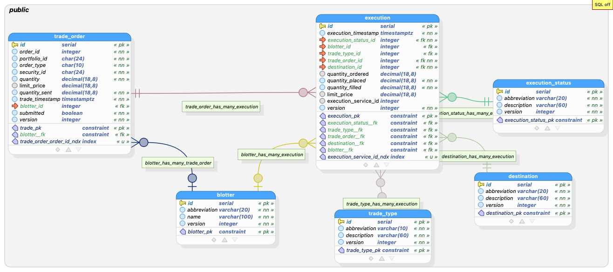

# GlobeCo Trade Service Requirements

## Background

This document provides requirements for the Trade Service.  This service is designed to manage trades as part of a portfolio management application.

This microservice will be deployed on Kubernetes 1.33.

This microservice is part of the GlobeCo suite of applications for benchmarking Kubernetes autoscaling.

Name of service: Trade Service  
Host: globeco-trade-service  
Port: 8002  

Author: Noah Kriehger  
Email: noah@kasbench.org

## Technology

| Technology | Version | Notes |
|---------------------------|----------------|---------------------------------------|
| Java | 21 | |
| Spring Boot | 3.4.5 | |
| Spring Dependency Mgmt | 1.1.7 | Plugin for dependency management |
| Spring Boot Starter Web | (from BOM) | For REST API |
| Spring Boot Starter Data JPA | (from BOM) | For JPA/Hibernate ORM |
| Spring Boot Starter Actuator | (from BOM) | For monitoring/management |
| Flyway Core | (from BOM) | Database migrations |
| Flyway Database PostgreSQL| (from BOM) | PostgreSQL-specific Flyway support |
| PostgreSQL JDBC Driver | (from BOM) | Runtime JDBC driver |
| JUnit Platform Launcher | (from BOM) | For running tests |
| Spring Boot Starter Test | (from BOM) | For testing |
| PostgreSQL (Database) | 17 | As specified in [globeco-trade-service-postgresql](https://github.com/kasbench/globeco-trade-service-postgresql) |

Notes:
- (from BOM) means the version is managed by the Spring Boot BOM (Bill of Materials) and will match the Spring Boot version unless overridden.
- All dependencies are managed via Maven Central.
- The project uses Gradle as the build tool.

## Other services

| Name | Host | Port | Description |
| --- | --- | --- | --- |
Security Service | globeco-security-service | 8000 | Manages securities such as stocks, bonds, and options |
| Order Service | globeco-order-service | 8001 |

## Caching
- Use Spring's caching abstraction for security, blotter, trade_type, trade_status, execution_status
- Caches should have a 5 minute EOL
- Initially, all caches should be with in-memory caching

## Database Information

The database is at globeco-trade-service-postgresql:32800
The database is the default `postgres` database.
The schema is the default `public` schema.
The owner of all database objects is `postgres`.

## Entity Relationship Diagram

## Data dictionary 

### _public_.**blotter** `Table`
| Name | Data type  | PK | FK | UQ  | Not null | Default value | Description |
| --- | --- | :---: | :---: | :---: | :---: | --- | --- |
| id | serial | &#10003; |  |  | &#10003; |  |  |
| abbreviation | varchar(20) |  |  |  | &#10003; |  |  |
| name | varchar(100) |  |  |  | &#10003; |  |  |
| version | integer |  |  |  | &#10003; | 1 |  |

#### Constraints
| Name | Type | Column(s) | References | On Update | On Delete | Expression | Description |
|  --- | --- | --- | --- | --- | --- | --- | --- |
| blotter_pk | PRIMARY KEY | id |  |  |  |  |  |

---

### _public_.**destination** `Table`
| Name | Data type  | PK | FK | UQ  | Not null | Default value | Description |
| --- | --- | :---: | :---: | :---: | :---: | --- | --- |
| id | serial | &#10003; |  |  | &#10003; |  |  |
| abbreviation | varchar(20) |  |  |  | &#10003; |  |  |
| description | varchar(60) |  |  |  | &#10003; |  |  |
| version | integer |  |  |  | &#10003; | 1 |  |

#### Constraints
| Name | Type | Column(s) | References | On Update | On Delete | Expression | Description |
|  --- | --- | --- | --- | --- | --- | --- | --- |
| destination_pk | PRIMARY KEY | id |  |  |  |  |  |

---

### _public_.**execution** `Table`
| Name | Data type  | PK | FK | UQ  | Not null | Default value | Description |
| --- | --- | :---: | :---: | :---: | :---: | --- | --- |
| id | serial | &#10003; |  |  | &#10003; |  |  |
| execution_timestamp | timestamptz |  |  |  | &#10003; | CURRENT_TIMESTAMP |  |
| execution_status_id | integer |  | &#10003; |  | &#10003; |  |  |
| blotter_id | integer |  | &#10003; |  |  |  |  |
| trade_type_id | integer |  | &#10003; |  |  |  |  |
| trade_order_id | integer |  | &#10003; |  | &#10003; |  |  |
| destination_id | integer |  | &#10003; |  | &#10003; |  |  |
| quantity_ordered | smallint |  |  |  |  |  |  |
| quantity_placed | decimal(18,8) |  |  |  | &#10003; |  |  |
| quantity_filled | decimal(18,8) |  |  |  | &#10003; | 0 |  |
| limit_price | decimal(18,8) |  |  |  |  |  |  |
| version | integer |  |  |  | &#10003; | 1 |  |

#### Constraints
| Name | Type | Column(s) | References | On Update | On Delete | Expression | Description |
|  --- | --- | --- | --- | --- | --- | --- | --- |
| execution_pk | PRIMARY KEY | id |  |  |  |  |  |
| execution_status__fk | FOREIGN KEY | execution_status_id | [public.execution_status](#public.execution_status) | CASCADE | RESTRICT |  |  |
| trade_type__fk | FOREIGN KEY | trade_type_id | [public.trade_type](#public.trade_type) | CASCADE | SET NULL |  |  |
| trade_order__fk | FOREIGN KEY | trade_order_id | [public.trade_order](#public.trade_order) | CASCADE | RESTRICT |  |  |
| destination__fk | FOREIGN KEY | destination_id | [public.destination](#public.destination) | CASCADE | RESTRICT |  |  |
| blotter__fk | FOREIGN KEY | blotter_id | [public.blotter](#public.blotter) | CASCADE | SET NULL |  |  |

---

### _public_.**execution_status** `Table`
| Name | Data type  | PK | FK | UQ  | Not null | Default value | Description |
| --- | --- | :---: | :---: | :---: | :---: | --- | --- |
| id | serial | &#10003; |  |  | &#10003; |  |  |
| abbreviation | varchar(20) |  |  |  | &#10003; |  |  |
| description | varchar(60) |  |  |  | &#10003; |  |  |
| version | integer |  |  |  | &#10003; | 1 |  |

#### Constraints
| Name | Type | Column(s) | References | On Update | On Delete | Expression | Description |
|  --- | --- | --- | --- | --- | --- | --- | --- |
| execution_status_pk | PRIMARY KEY | id |  |  |  |  |  |

---

### _public_.**trade_order** `Table`
| Name | Data type  | PK | FK | UQ  | Not null | Default value | Description |
| --- | --- | :---: | :---: | :---: | :---: | --- | --- |
| id | serial | &#10003; |  |  | &#10003; |  |  |
| order_id | integer |  |  |  | &#10003; |  |  |
| portfolio_id | char(24) |  |  |  | &#10003; |  |  |
| order_type | char(10) |  |  |  | &#10003; |  |  |
| security_id | char(24) |  |  |  | &#10003; |  |  |
| quantity | decimal(18,8) |  |  |  | &#10003; |  |  |
| limit_price | decimal(18,8) |  |  |  |  |  |  |
| trade_timestamp | timestamptz |  |  |  | &#10003; | CURRENT_TIMESTAMP |  |
| version | integer |  |  |  | &#10003; | 1 |  |
| blotter_id | integer |  | &#10003; |  |  |  |  |

#### Constraints
| Name | Type | Column(s) | References | On Update | On Delete | Expression | Description |
|  --- | --- | --- | --- | --- | --- | --- | --- |
| trade_pk | PRIMARY KEY | id |  |  |  |  |  |
| blotter__fk | FOREIGN KEY | blotter_id | [public.blotter](#public.blotter) | CASCADE | SET NULL |  |  |

#### Indexes
| Name | Type | Column(s) | Expression(s) | Predicate | Description |
|  --- | --- | --- | --- | --- | --- |
| trade_order_order_id_ndx | btree | order_id |  |  |  |

---

### _public_.**trade_type** `Table`
| Name | Data type  | PK | FK | UQ  | Not null | Default value | Description |
| --- | --- | :---: | :---: | :---: | :---: | --- | --- |
| id | serial | &#10003; |  |  | &#10003; |  |  |
| abbreviation | varchar(10) |  |  |  | &#10003; |  |  |
| description | varchar(60) |  |  |  | &#10003; |  |  |
| version | integer |  |  |  | &#10003; | 1 |  |

#### Constraints
| Name | Type | Column(s) | References | On Update | On Delete | Expression | Description |
|  --- | --- | --- | --- | --- | --- | --- | --- |
| trade_type_pk | PRIMARY KEY | id |  |  |  |  |  |

## Data Migrations

### Initialization data for trade_type

| abbreviation | description | version |
| --- | --- | --- |
| BUY | Buy | 1 |
| SELL | Sell | 1 |
| SHORT | Sell to Open | 1 |
| COVER | Buy to Close | 1 |
| EXRC | Exercise | 1 |

---

### Initialization data for execution_status

| abbreviation | description | version |
| --- | --- | --- |
| NEW | New | 1 |
| SENT | Sent | 1 |
| WORK | In progress | 1 |
| FULL | Filled | 1 |
| PART | Partial fill | 1 |
| HOLD | Hold | 1 |
| CNCL | Cancel | 1 |
| CNCLD | Cancelled | 1 |
| CPART | Cancelled with partial fill | 1 |
| DEL | Delete | 1 |

---

### Initialization data for blotter

| abbreviation | name | version | 
| --- | --- | --- |
| Default | Default | 1 |
| EQ | Equity | 1 |
| FI | Fixed Income | 1 |
| HOLD | Hold | 1 |

---

### Initialization data for destination

| abbreviation | description | version |
| --- | --- | --- |
| ML | Merrill Lynch | 1 |
| RBC | Royal Bank of Canada | 1 |
| JPM | Chase | 1 |
| IB | Interactive Brokers | 1 |
| INST | Instinet | 1 |
| POSIT | Posit | 1 |
---

## DTOs

### Blotter DTOs
- **BlotterResponseDTO**: Contains all fields from the blotter table.
  - id: Integer
  - abbreviation: String
  - name: String
  - version: Integer
- **BlotterPutDTO**: Contains all fields from the blotter table (for PUT requests).
  - id: Integer
  - abbreviation: String
  - name: String
  - version: Integer
- **BlotterPostDTO**: Contains all fields except id and version (for POST requests).
  - abbreviation: String
  - name: String

### TradeType DTOs
- **TradeTypeResponseDTO**: Contains all fields from the trade_type table.
  - id: Integer
  - abbreviation: String
  - description: String
  - version: Integer
- **TradeTypePutDTO**: Contains all fields from the trade_type table (for PUT requests).
  - id: Integer
  - abbreviation: String
  - description: String
  - version: Integer
- **TradeTypePostDTO**: Contains all fields except id and version (for POST requests).
  - abbreviation: String
  - description: String

### Destination DTOs
- **DestinationResponseDTO**: Contains all fields from the destination table.
  - id: Integer
  - abbreviation: String
  - description: String
  - version: Integer
- **DestinationPutDTO**: Contains all fields from the destination table (for PUT requests).
  - id: Integer
  - abbreviation: String
  - description: String
  - version: Integer
- **DestinationPostDTO**: Contains all fields except id and version (for POST requests).
  - abbreviation: String
  - description: String

### ExecutionStatus DTOs
- **ExecutionStatusResponseDTO**: Contains all fields from the execution_status table.
  - id: Integer
  - abbreviation: String
  - description: String
  - version: Integer
- **ExecutionStatusPutDTO**: Contains all fields from the execution_status table (for PUT requests).
  - id: Integer
  - abbreviation: String
  - description: String
  - version: Integer
- **ExecutionStatusPostDTO**: Contains all fields except id and version (for POST requests).
  - abbreviation: String
  - description: String

### TradeOrder DTOs
- **TradeOrderResponseDTO**: Contains all fields from the trade_order table, with blotter as a nested BlotterResponseDTO.
  - id: Integer
  - orderId: Integer
  - portfolioId: String
  - orderType: String
  - securityId: String
  - quantity: BigDecimal
  - limitPrice: BigDecimal
  - tradeTimestamp: OffsetDateTime
  - version: Integer
  - blotter: BlotterResponseDTO
- **TradeOrderPutDTO**: Contains all fields from the trade_order table (for PUT requests, no nesting).
  - id: Integer
  - orderId: Integer
  - portfolioId: String
  - orderType: String
  - securityId: String
  - quantity: BigDecimal
  - limitPrice: BigDecimal
  - tradeTimestamp: OffsetDateTime
  - version: Integer
  - blotterId: Integer
- **TradeOrderPostDTO**: Contains all fields except id and version (for POST requests, no nesting).
  - orderId: Integer
  - portfolioId: String
  - orderType: String
  - securityId: String
  - quantity: BigDecimal
  - limitPrice: BigDecimal
  - tradeTimestamp: OffsetDateTime
  - blotterId: Integer

### Execution DTOs
- **ExecutionResponseDTO**: Contains all fields from the execution table, with all foreign keys as nested ResponseDTOs.
  - id: Integer
  - executionTimestamp: OffsetDateTime
  - executionStatus: ExecutionStatusResponseDTO
  - blotter: BlotterResponseDTO
  - tradeType: TradeTypeResponseDTO
  - tradeOrder: TradeOrderResponseDTO
  - destination: DestinationResponseDTO
  - quantityOrdered: Short
  - quantityPlaced: BigDecimal
  - quantityFilled: BigDecimal
  - limitPrice: BigDecimal
  - version: Integer
- **ExecutionPutDTO**: Contains all fields from the execution table (for PUT requests, no nesting).
  - id: Integer
  - executionTimestamp: OffsetDateTime
  - executionStatusId: Integer
  - blotterId: Integer
  - tradeTypeId: Integer
  - tradeOrderId: Integer
  - destinationId: Integer
  - quantityOrdered: Short
  - quantityPlaced: BigDecimal
  - quantityFilled: BigDecimal
  - limitPrice: BigDecimal
  - version: Integer
- **ExecutionPostDTO**: Contains all fields except id and version (for POST requests, no nesting).
  - executionTimestamp: OffsetDateTime
  - executionStatusId: Integer
  - blotterId: Integer
  - tradeTypeId: Integer
  - tradeOrderId: Integer
  - destinationId: Integer
  - quantityOrdered: Short
  - quantityPlaced: BigDecimal
  - quantityFilled: BigDecimal
  - limitPrice: BigDecimal

